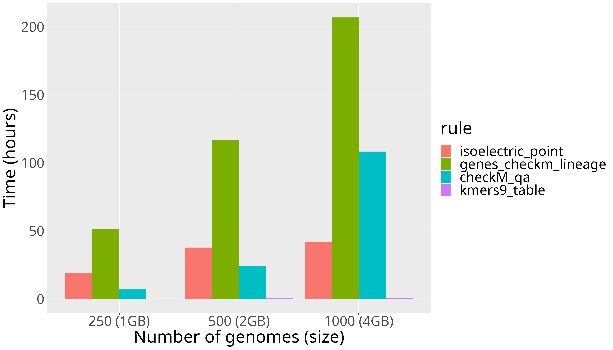
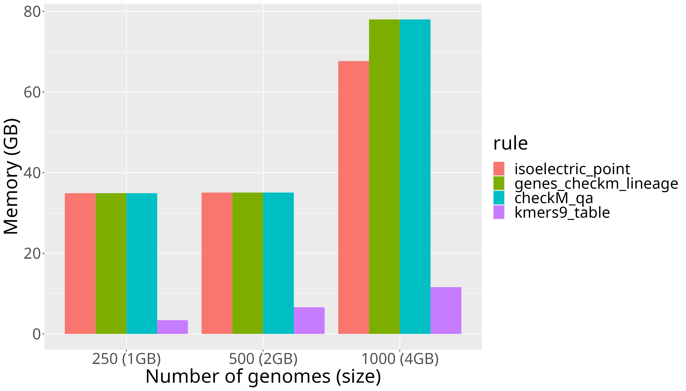
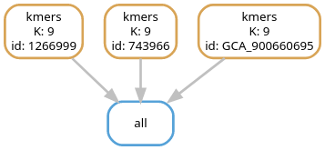

# Snakemake workflow: Features Pipeline

A Snakemake workflow for extracting features from bacterial genomes, such as kmers and gene families. In this tutorial, you will learn how to use the pipeline with the example input provided in folder *genomes*. After learning, you can use it with your own data. 

<p align="center">
  
</p>

# TODOs

- Follow structure described in: https://github.com/snakemake-workflows/snakemake-workflow-template/tree/main
	- Adapt usage to structure of "Snakemake Workflow Catalog"

# Cloning the repository

The first step to use the pipeline is to clone the GIT repository in your high-performance cluster:

```
#Clone using https
git clone https://github.com/waltercostamb/features_pipeline.git
```

You could clone the repository using something else from https. To know what is the best option for you, consult your cluster manager.

## Working on draco HPC of the Friedrich-Schiller University Jena

If you are using this pipeline in draco, you do not need to do any extra steps, since the conda environments are already installed. Skip section "Working on other HPCs".

## Working on other HPCs

If you are using this pipeline in another cluster, perform the steps below. You will need to comment and uncomment some lines of code for testing conda environments outside of the draco cluster. After your tests, we will improve the pipeline and its handling of conda environments.  

- git clone this repository

```
cd PATH
#Clone using https
git clone https://github.com/waltercostamb/features_pipeline.git
#Alternative to https: clone using ssh
git clone git@github.com:waltercostamb/features_pipeline.git
#If neither https nor ssh work, ask your cluster manager on how to best clone a GIT repository
```

- After cloning the repository, access the file *Snakefile* with your editor of choice (such as nano or vim) and do the following:
- Uncomment the line below of **rule all** (line 79)
  
```
expand("{output_features}/bins/{id}/genes.gff", id=genomeID_lst, output_features=output_features)
```
- Comment all other lines of **rule all** (lines 75, 81, 85 and 87), so that rule all looks like below:

```
rule all:
        input:
                #kmers_gerbil
                #expand("{output_features}/kmer_files/{id}_kmer{K}.txt", id=genomeID_lst, K=K, output_features=output_features),
                #kmers_table
                #expand("{output_features}/kmer{K}_profiles.tsv", output_features=output_features, K=K),
                #genes_checkm_lineage
                #expand("{output_features}/bins/{id}/genes.faa", id=genomeID_lst, output_features=output_features)
                #genes_checkm_lineage_yaml
                expand("{output_features}/bins/{id}/genes.gff", id=genomeID_lst, output_features=output_features)
                #genes_checkm_qa
                #expand("{output_features}/bins/{id}/{id}-qa.txt", id=genomeID_lst, output_features=output_features),
                #gene_families_emapper
                #expand("{output_features}/proteins_emapper/{id}", id=genomeID_lst, output_features=output_features)
                #gene_families_table
                #expand("{output_features}/gene-family_profiles.csv", output_features=output_features),
                #isoelectric_point
                #expand("{output_features}/isoelectric_point_files/{id}-iso_point.csv", id=genomeID_lst, output_features=output_features)
```

- Save the modifications you made in file *Snakefile* and quit the editor

# Usage

After cloning the repository, do the following steps:

- Create *config/files.txt* with the list of the input files provided in the repository with the command line below:

```
ls -lh genomes/ | sed 's/  */\t/g' | cut -f9 | sed 's/\.fasta//g' | grep -v '^$' > config/files.txt
```

To use the pipeline with the example files, you can submit a job to the slurm queue with the *scripts/snakemake.sbatch* script provided in the repository.   

If you are using the draco HPC, run the following command to submit the job to slurm:

```
sbatch scripts/snakemake.sbatch
```

If you are not using the draco cluster, you should adapt *snakemake.sbatch* to your cluster. Most importantly, change the conda activation command lines. For installation of snakemake, consult: https://snakemake.readthedocs.io/en/stable/getting_started/installation.html.

## Expected output

The example input you just submitted to the queue contains the three following genomes:

```
$ls genomes/
1266999.fasta  743966.fasta  GCA_900660695.fasta
```

If you run the example input, you will obtain their kmer profiles, gene families, checkm qa reports and isoelectric points of proteins. The output of the kmer rule follows:

```
#Individual kmer profiles
$ls output/kmer_files/ 
1266999_kmer9.txt  743966_kmer9.txt  GCA_900660695_kmer9.txt
#TSV file combining all profiles
$ls output/
kmer9_profiles.tsv
```

## Use the pipeline with your data

To use the pipeline with your own data:

- Make sure the directory which contains your bacterial genomes (or contigs) is named *genomes* (in lowercase)
- Make sure the FASTA files have the extension *.fasta*
  - the pipeline assumes your files are named in the following way: FILE\_ID.fasta
- Create *config/files.txt* containing the FILE\_IDs you want to run through the pipeline:

```
ls -lh genomes/ | sed 's/  */\t/g' | cut -f9 | sed 's/\.fasta//g' | grep -v '^$' > config/files.txt
```

- Adapt (if needed) the config and/or sbatch files:

```
#Adapt files if needed
vim config/config.json
vim scripts/snakefile.sbatch
```

## Config.json

UNDER CONSTRUCTION.

## snakefile.sbatch

File *scripts/snakefile.sbatch* contains information for your cluster, such as required memory and threads. For just a few files, this is not a big concern. However, for a larger amount of files, you should make sure to allocate enough memory and threads. For calculation of requirements, check the "Performance" section below.

## Choosing specific rules

The default mode of Snakefile is to run all rules. If you want to run one or only a few specific rules, change the commented lines in `rule all` of the Snakefile.

# Performance

Below follows the time and memory performance of the pipeline for 3 different input sizes. For these calculations, we used 1 core and default parameters of *config/config.json*. Note that "emapper_block_size" is already set to a higher value of 10.0 in *config/config.json*. The default value of EggNOG emapper's "emapper_block_size" is actually 2.0. Increasing this value to 10.0 increases memory consumption, but reduces run time.  

Time performance            |  Memory performance
:-------------------------:|:-------------------------:
  |  

*CheckM lineage_wf* is required for the following rules: *isoelectric_point*, *genes_checkm_lineage* and *checkM_qa*. It is the most memory demanding process, causing the memory requirements to be the same for these three rules.  

Aditionally, the run time to calculate the isoelectric points (IP) per file is ~2min 10sec. This was calculated as the average run time of 500 files. In addition to calculating the IPs, the rule *isoelectric_point* also requires *CheckM lineage_wf*.  

The run time to calculate qa reports with *CheckM qa* is ~6min 7sec. This was calculated as the average run time of 160 files. Similarly as for rule *isoelectric_point*, the rule *checkM_qa* also requires *CheckM lineage_wf*.  

The run time to calculate EggNOG emapper reports is ~12min. This was calculated as the average run time of 250 files. The rule *genes_checkm_lineage* also requires *CheckM lineage_wf*. Below follows an example of how this information can be used to calculate run time and required memory to parallelize the *gene_families_emapper* rule.

# Parallelization

Use the following formula to calculate threads and memory requirements.

- Run time of 1 file = 12 min, given 40 threads and 30 GB memory

Parallelizing the pipeline for 6 files, yields:

- Run time of 6 files = 12 min, given 6 x 40 threads and 6 x 30 GB memory 

The default parallelization of the pipeline is 3. If you want to change that, modify file *snakefile.sbatch*. For 6 files, you can change the default to: 

```
#!/bin/bash
#SBATCH --job-name=smk
#SBATCH --output=smk_%j.out
#SBATCH --error=smk_%j.err
#SBATCH --cpus-per-task=240
#SBATCH --partition=standard
#SBATCH --mem=180G

module purge
source /vast/groups/VEO/tools/anaconda3/etc/profile.d/conda.sh
conda activate snakemake_v8.3.1

snakemake --use-conda --cores 6 --configfile config.json --snakefile Snakefile
conda deactivate
```

# Available features

A directed acyclic graph (DAG) is shown for each feature. It describes the pipeline's hierarchy of rules. Below you see a simplified DAG with all implemented rules for one input genome.

<p align="center">
  
</p>

## kmers

kmers are sub-sequences of a genome. Kmers have length k, which can be defined by the user. The default is 9. If you want a different k, change it in file config.json. Kmers are calculated with Gerbil. An in-house script creates a table with kmers per file ID. Rule: kmers.

<p align="center">
  
</p>

## Gene families

Genes are first predicted with CheckM (which uses prodigal internally) from the bacterial genomes. Afterwards, families are assigned with eggnog emapper. Finally, an in-house script creates a table with gene families per file ID: 1 symbols the presence of that family in the file ID, while 0 symbols absence.
Rules: genes_checkm and gene_families_emapper. 


<p align="center">
  
</p>

## GC content

Is calculated by CheckM. 
Rule: genes_checkm. 

## Genome size (nt)

Is calculated by CheckM. 
Rule: genes_checkm. 

## Genome completeness

Is calculated by CheckM. 
Rule: genes_checkm. 

## Isoelectric points of proteins 

Proteins are annotated by checkM (using prodigal internally). Isoelectric point of proteins is calculated by EMBOSS pepstats. Lastaly, the output of pepstats is formated by an in-house script.
Rules: genes_checkm and isoelectric_point.


