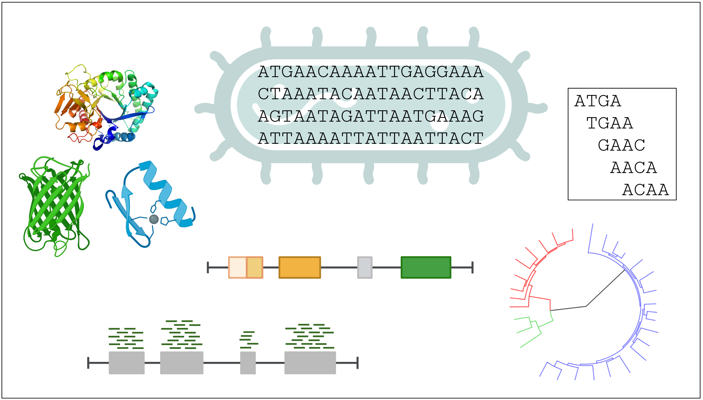
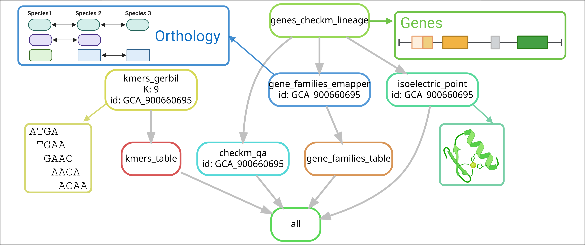

# Snakemake workflow: Features Pipeline

This workflow extracts different genomic features from prokaryotic genomes. The input is a folder containing genomic FASTA files and the output are text files containing genomic features. Click on the [list of features](https://github.com/waltercostamb/features_pipeline/tree/main?tab=readme-ov-file#available-features) to see the available ones.  

In this tutorial, you will learn how to use the pipeline with the example input provided in folder ```genomes```. After learning, you can use it with your own data. 

<p align="center">
  
</p>

Within the pipeline the following software are used:

- Jellyfish: https://github.com/gmarcais/Jellyfish
- CheckM: https://github.com/Ecogenomics/CheckM
- EMBOSS pepstats: https://www.ebi.ac.uk/jdispatcher/docs/
- EggNOG emapper: https://github.com/eggnogdb/eggnog-mapper
- Jaeger: https://github.com/Yasas1994/Jaeger

# Installation

## Cloning the repository

The first step to use the pipeline is to clone and access the GIT repository:

```
#Clone using https
git clone https://github.com/waltercostamb/features_pipeline.git
```
You could clone the repository using something else from https. To know what is the best option for you, consult your admin.

## Downloading databases

If you are using this pipeline in the draco high-performance cluster and are part of the VEO group, skip this section.  

After cloning the repository, you need to download the database required by EggNOG emapper:

- Install EggNOG emapper: https://github.com/eggnogdb/eggnog-mapper/wiki/eggNOG-mapper-v2.1.5-to-v2.1.12#installation
- Download the database with ```download_eggnog_data.py``` following: https://github.com/eggnogdb/eggnog-mapper/wiki/eggNOG-mapper-v2.1.5-to-v2.1.12#setup This should download a DB of ~50 GB
- Change file ```config/config.json``` to update parameter "emapper_db_dir". This parameter contains the path to the eggnog database. The default is ```/work/groups/VEO/databases/emapper/v20230620```

## Dependencies

If you are using this pipeline in the draco high-performance cluster and are part of the VEO group, skip this section.   

To use this pipeline you should install Snakemake version 7. For this, consult: https://snakemake.readthedocs.io/en/stable/getting_started/installation.html.

# Usage

After cloning the repository, do the following steps:

```
#Go to the newly created folder
cd features_pipeline
#See what is inside the folder
ls
#config figures README.md workflow genomes simple
#See the example files
ls genomes
#1266999.fasta 743966.fasta GCA_900660695.fasta
```

- Create ```config/files.txt``` with the list of the input files provided in the repository with the command line below:

```
ls -1 genomes/*fasta | sed 's/\.fasta//g' | sed 's/genomes\///g' | grep -v '^$' > config/files.txt
```

To use the pipeline with the example files, you can submit a job to the slurm queue with ```workflow/scripts/snakemake.sbatch```, as below. ```snakemake.sbatch``` is a script that runs snakemake (see section [snakefile.sbatch](https://github.com/waltercostamb/features_pipeline/tree/main?tab=readme-ov-file#snakefilesbatch) for details).

```
sbatch workflow/scripts/snakefile.sbatch
```

If you are not using the draco cluster, you should adapt ```workflow/scripts/snakemake.sbatch``` to fit your cluster. Most importantly, change the conda activation command lines. 

## Expected output

The example input you just submitted to the queue contains the three following genomes:

```
ls genomes/
1266999.fasta  743966.fasta  GCA_900660695.fasta
```

If you run the example input, you will obtain their [kmer profiles](https://github.com/waltercostamb/features_pipeline/tree/main?tab=readme-ov-file#kmers), eggNOG [gene families](https://github.com/waltercostamb/features_pipeline/tree/main?tab=readme-ov-file#gene-families), genome/contig/MAG quality reports from CheckM, [isoelectric points of proteins](https://github.com/waltercostamb/features_pipeline/tree/main?tab=readme-ov-file#isoelectric-points-of-proteins) and [identified prophages](https://github.com/waltercostamb/features_pipeline/tree/main?tab=readme-ov-file#prophages). For the example files, the folder tree of results follows below. For specific outputs of each rule, consult section [Available features](https://github.com/waltercostamb/features_pipeline/tree/main?tab=readme-ov-file#available-features).  

```
results
├── bins
│   ├── 1266999
│   ├── 743966
│   └── GCA_900660695
├── isoelectric_point_files
├── jaeger
├── kmer_files
├── proteins_emapper
│   ├── 1266999
│   ├── 743966
│   └── GCA_900660695
└── storage
    ├── aai_qa
    │   ├── 1266999
    │   └── 743966
    └── tree
```

## Using the pipeline with your data

To use the pipeline with your own data:

- Save your genome files into a folder

The default folder name is ```genomes```. If you change the name, make sure to update the following line of ```config/config.json``` with the current name: 

```   "input_folder": "CURRENT_NAME",```

- Make sure the genome files have the extension ```.fasta```, otherwise the pipeline will not find your genomes
- Create file ```config/files.txt``` containing the genome names:

```
ls -1 genomes/*fasta | sed 's/\.fasta//g' | sed 's/genomes\///g' | grep -v '^$' > config/files.txt
```

- If you wish to change any default configuration or variable, adapt the config and/or sbatch files:

```
#Adapt files if needed
vim config/config.json
vim simple/config.yaml
vim workflow/scripts/snakefile.sbatch
```

## snakefile.sbatch

File ```workflow/scripts/snakefile.sbatch``` (see content below) is a script that runs the snakemake pipeline. It contains information for the slurm cluster. If you submit this script to slurm, it will act as a *master* by sending small jobs to the queue corresponding to individual rules of the pipeline. The line below contains parameters of Snakemake: ```jobs 50``` indicates how many jobs the *master* script will send to slurm at the same time; ```--profile simple``` indicates the folder containing the configuration file for the cluster.  

```
#Command line to run the snakemake pipeline
snakemake --use-conda --conda-frontend conda --configfile config/config.json --jobs 3 --profile simple``` 
```

Content of ```workflow/scripts/snakefile.sbatch```:

```
#!/bin/bash
#SBATCH --job-name=smk_main
#SBATCH --output=smk_main_%j.out
#SBATCH --error=smk_main_%j.err
#SBATCH --cpus-per-task=1
#SBATCH --hint=nomultithread
#SBATCH --partition=long
#SBATCH --mem=5G

#Unload any active module
module purge
#Load modules for snakemake (in the draco cluster)
source /vast/groups/VEO/tools/anaconda3/etc/profile.d/conda.sh
#Activate snakemake conda environment
conda activate snakemake_v7.24.0

#Run Snakemake
#snakemake --use-conda --conda-frontend conda --cores 1 --configfile config/config.json
snakemake --use-conda --conda-frontend conda --configfile config/config.json --jobs 50 --profile simple

#Deactivate conda environment
conda deactivate
```

## Choosing specific rules

The default mode of Snakefile is to run all rules. If you want to run only one or a few specific rules, change the commented lines in `rule all` of the Snakefile.  

The default of rule all follows below. In this case all rules are active.

```
rule all:
	input: 
		#kmers_jellyfish
		#expand("{output_features}/kmer_files/{id}_kmer{K}.txt", id=genomeID_lst, K=K, output_features=output_features),
		#kmers_table
		expand("{output_features}/kmer{K}_profiles.tsv", output_features=output_features, K=K),
		#genes_checkm_lineage
		#expand("{output_features}/bins/{id}/genes.faa", id=genomeID_lst, output_features=output_features),
		#genes_checkm_qa
		expand("{output_features}/bins/{id}/{id}-qa.txt", id=genomeID_lst, output_features=output_features),
		#gene_families_emapper
		#expand("{output_features}/proteins_emapper/{id}", id=genomeID_lst, output_features=output_features)
		#gene_families_table
		expand("{output_features}/gene-family_profiles.csv", output_features=output_features),
		#isoelectric_point
		#expand("{output_features}/isoelectric_point_files/{id}-iso_point.csv", id=genomeID_lst, output_features=output_features)
		#isoelectric_point_table
		expand("{output_features}/iso-points_profiles_known_orthologs.csv", output_features=output_features),
		#prophages_jaeger
		expand("{output_features}/prophages_jaeger/{id}_default_jaeger.tsv", output_features=output_features, id=genomeID_lst)
```

As an example, say you only want to run Jellyfish to generate kmer counts, without creating any table. In this case, comment all lines and uncomment the line below "kmers_jellyfish". It should look like:

```
rule all:
	input: 
		#kmers_jellyfish
		expand("{output_features}/kmer_files/{id}_kmer{K}.txt", id=genomeID_lst, K=K, output_features=output_features),
		#kmers_table
		#expand("{output_features}/kmer{K}_profiles.tsv", output_features=output_features, K=K),
		#genes_checkm_lineage
		#expand("{output_features}/bins/{id}/genes.faa", id=genomeID_lst, output_features=output_features),
		#genes_checkm_qa
		#expand("{output_features}/bins/{id}/{id}-qa.txt", id=genomeID_lst, output_features=output_features),
		#gene_families_emapper
		#expand("{output_features}/proteins_emapper/{id}", id=genomeID_lst, output_features=output_features)
		#gene_families_table
		#expand("{output_features}/gene-family_profiles.csv", output_features=output_features),
		#isoelectric_point
		#expand("{output_features}/isoelectric_point_files/{id}-iso_point.csv", id=genomeID_lst, output_features=output_features)
		#isoelectric_point_table
		#expand("{output_features}/iso-points_profiles_known_orthologs.csv", output_features=output_features),
		#prophages_jaeger
		#expand("{output_features}/prophages_jaeger/{id}_default_jaeger.tsv", output_features=output_features, id=genomeID_lst)
```

# Available features

A directed acyclic graph (DAG) is shown for each feature. It describes the pipeline's hierarchy of rules. Below you see a simplified DAG with all implemented rules for one input genome.

<p align="center">
  
</p>

## Gene families

Genes are first predicted with CheckM (which uses prodigal internally) from the input genomes. Afterwards, families are assigned with eggNOG emapper. Finally, an in-house script creates a table with gene families per file ID: 1 indicates the presence of that family in that file, while 0 indicates absence. Rules: genes_checkm and gene_families_emapper.   

## kmers

kmers are sub-sequences of a genome. Kmers have length k, which can be defined by the user. The default is 9. If you want a different k, change it in file config.json. Kmers are calculated with Gerbil. An in-house script creates a table with kmers per file ID. Rules: kmers_jellyfish and kmers_table.   

Output:   

- ```results/kmer_files/FILE_ID_kmer9.txt```: FASTA files per input genomes with the kmer profile produced by Jellyfish   
- ```results/kmer9_profiles.tsv```: a single tsv file combining all profiles for genomes indicated in ```config/files.txt```

## GC content

Is calculated by CheckM. 
Rule: genes_checkm. 

## Genome size (nt)

Is calculated by CheckM. 
Rule: genes_checkm. 

## Genome completeness

Is calculated by CheckM. 
Rule: genes_checkm. 

## Isoelectric points of proteins 

Proteins are annotated by checkM (using prodigal internally). Isoelectric point of proteins is calculated by EMBOSS pepstats. Lastly, the output of pepstats is formated by an in-house script.
Rules: genes_checkm and isoelectric_point.

## Prophages

Phage genomes are identified in the prokaryotic genomes using Jager. Rule: prophages_jaeger.
