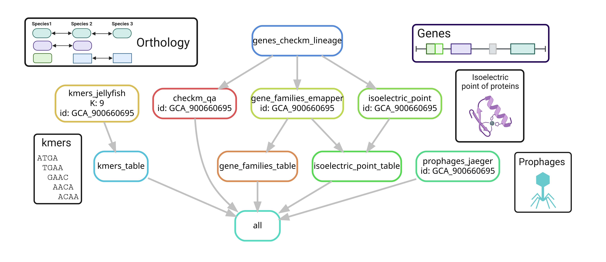
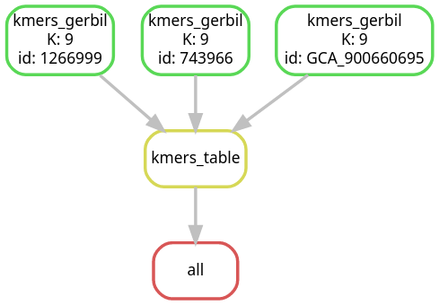
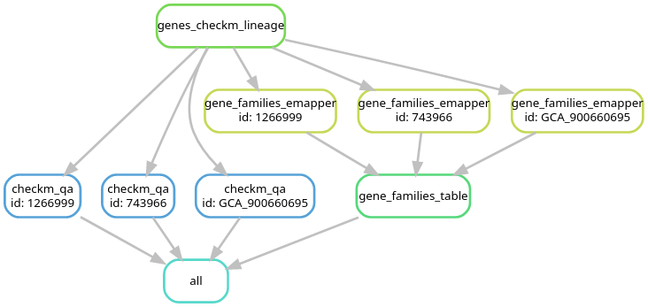

# Features pipeline

This pipeline extracts features from bacterial genomes, such as kmers and gene orthologs. In this tutorial, you will learn how to use the pipeline with the example input provided in folder *genomes*. After learning how to use the pipeline, you can use it with your own data. 

<p align="center">
  
</p>

# Cloning the repository

The first step to use the pipeline is to clone the GIT repository in your high-performance cluster:

```
#Clone using https
git clone https://github.com/waltercostamb/features_pipeline.git
```
## Working on draco HPC of the Friedrich-Schiller University Jena

If you are using this pipeline in draco, you do not need to do any extra steps, since the conda environments are already installed.

## Working on other HPCs

If you are using this pipeline in another cluster, perform the steps below. You will need to comment and uncomment some lines of code for testing conda environments outside of the draco cluster. After your tests, we will improve the pipeline and its handling of conda environments.  

- git clone this repository

```
cd PATH
#Clone using https
git clone https://github.com/waltercostamb/features_pipeline.git
#Alternative to https: clone using ssh
git clone git@github.com:waltercostamb/features_pipeline.git
#If neither https nor ssh work, ask your cluster manager on how to best clone a GIT repository
```

- After cloning the repository, access the file *Snakefile* with your editor of choice (such as nano or vim) and do the following:
- Uncomment the line below of **rule all** (line 79)
  
```
expand("{output_features}/bins/{id}/genes.gff", id=genomeID_lst, output_features=output_features)
```
- Comment all other lines of **rule all** (lines 75, 81, 85 and 87), so that rule all looks like below:

```
rule all:
        input:
                #kmers_gerbil
                #expand("{output_features}/kmer_files/{id}_kmer{K}.txt", id=genomeID_lst, K=K, output_features=output_features),
                #kmers_table
                #expand("{output_features}/kmer{K}_profiles.tsv", output_features=output_features, K=K),
                #genes_checkm_lineage
                #expand("{output_features}/bins/{id}/genes.faa", id=genomeID_lst, output_features=output_features)
                #genes_checkm_lineage_yaml
                expand("{output_features}/bins/{id}/genes.gff", id=genomeID_lst, output_features=output_features)
                #genes_checkm_qa
                #expand("{output_features}/bins/{id}/{id}-qa.txt", id=genomeID_lst, output_features=output_features),
                #gene_families_emapper
                #expand("{output_features}/proteins_emapper/{id}", id=genomeID_lst, output_features=output_features)
                #gene_families_table
                #expand("{output_features}/gene-family_profiles.csv", output_features=output_features),
                #isoelectric_point
                #expand("{output_features}/isoelectric_point_files/{id}-iso_point.csv", id=genomeID_lst, output_features=output_features)
```

- Save the modifications you made in file *Snakefile* and quit the editor

- Create *files.txt* with the list of the input files provided in the repository:

```
ls -lh genomes/ | sed 's/  */\t/g' | cut -f9 | sed 's/\.fasta//g' | grep -v '^$' > files.txt
```

- Activate the snakemake environment of your cluster. For installation, consult: https://snakemake.readthedocs.io/en/stable/getting_started/installation.html. Alternatively, consult your cluster manager.   
- Run the pipeline with the provided input as below:

```
snakemake --use-conda --cores 3 --configfile config.json --snakefile Snakefile
```

# Usage

To learn how to use the pipeline, run it with the examples provided in this repository.  

Example input:  

```
$ls genomes/
1266999.fasta  743966.fasta  GCA_900660695.fasta
```

If you run the example input, you will obtain their kmer profiles, gene families, checkm qa reports and isoelectric points of proteins. The output of the kmer rule follows:

```
#Individual kmer profiles
$ls output/kmer_files/ 
1266999_kmer9.txt  743966_kmer9.txt  GCA_900660695_kmer9.txt
#TSV file combining all profiles
$ls output/
kmer9_profiles.tsv
```

To run the examples, use the provided scripts without any changes following the instructions below.   
 
To run the pipeline, you can either allocate a node and run the pipeline directly on the command line or submit a job to the slurm queueing system. We recommend you to allocate a node only for testing and to submit a job to the queue to run your final pipeline. Importantly, some of the required software (such as CheckM) require more memory, so make sure to allocate enough of it in your *snakefile.sbatch* file (more details in the following section "Performance"). For the example files, a standard node is enough.

- Submit an sbatch file to the slurm queueing system, as if the *Snakefile* would be a usual script:

```
#Activate Snakemake
source /home/groups/VEO/tools/anaconda3/etc/profile.d/conda.sh && conda activate snakemake_v7.24.0
#Submit the pipeline to the slurm queue with sbatch
sbatch snakefile.sbatch 
```

or:

- Allocate a node
- run Snakemake directly in the command line, as below

```
#Allocate a node
salloc --partition=standard

#Activate Snakemake in HPC draco
source /home/groups/VEO/tools/anaconda3/etc/profile.d/conda.sh && conda activate snakemake_v7.24.0
#Alternatively, Activate Snakemake in your server according to your manager's orientations

#Run snakemake
snakemake --use-conda --cores 3 --configfile config.json --snakefile /home/no58rok/features_pipeline/Snakefile
```

## Using your data

To use the pipeline with your own data:

- Make sure the directory which contains your bacterial genomes (or contigs) is named *genomes* (in lowercase)
- Make sure the FASTA files have the extension *.fasta*
  - the pipeline assumes your files are named in the following way: FILE\_ID.fasta
- Create *files.txt* containing the FILE\_IDs you want to run through the pipeline:

```
ls -lh genomes/ | sed 's/  */\t/g' | cut -f9 | sed 's/\.fasta//g' | grep -v '^$' > files.txt
```

- Copy and (if needed) adapt the config and/or sbatch files:

```
#Copy original files
cp PATH/features_pipeline/Snakefile .
cp PATH/features_pipeline/config.json .
cp PATH/features_pipeline/snakefile.sbatch .
#Adapt files if needed
vim config.json
vim snakefile.sbatch
```

## Run specific rules

The default mode of Snakefile is to run all rules. If you want to run a specific rule: copy the Snakefile to the folder you are running your samples, uncomment the command line(s) referring to the desired feature(s) and comment the other lines. Then adapt your snakemake.sbatch file and run it. 

# Performance

Below follows the time and memory performance of the pipeline for 3 different input sizes. For these calculations, we used 1 core and default parameters, with the exception of "emapper_block_size", which was set to a higher value of 10.0. The default value of EggNOG emapper's "emapper_block_size" is 2.0. Increasing this value to 10.0 increases memory consumption, but reduces run time.  

Time performance            |  Memory performance
:-------------------------:|:-------------------------:
  |  

*CheckM lineage_wf* is required for the following rules: *isoelectric_point*, *genes_checkm_lineage* and *checkM_qa*. It is the most memory demanding process, causing the memory requirements to be the same for these three rules.  

Aditionally, the run time to calculate the isoelectric points (IP) per file is on average 2min 10sec. This was calculated as the average run time of 500 files. In addition to calculating the IPs, the rule *isoelectric_point* also requires *CheckM lineage_wf*.  

The run time to calculate qa reports with *CheckM qa* is on average 6min 7sec. This was calculated as the average run time of 160 files. Similarly as for rule *isoelectric_point*, the rule *checkM_qa* also requires *CheckM lineage_wf*.  

The run time to calculate EggNOG emapper reports is on average 12min. This was calculated as the average run time of 250 files. The rule *genes_checkm_lineage* also requires *CheckM lineage_wf*. Below follows an example of how this information can be used to calculate run time:

- 1 file = 12 min follows that: 13,554 files = 162,660 min (or 113 days for 1 core)
- Parallelizing the pipeline into 40 cores = 2,83 days
- To run the complete rule *genes_checkm_lineage*, 2,83 days are required plus the *CheckM lineage_wf* run time (~3 days) = 6 days

# Available features

A directed acyclic graph (DAG) is shown for each feature. It describes the pipeline's hierarchy of rules. Below you see a simplified DAG with all implemented rules for one input genome.

<p align="center">
  
</p>

## kmers

kmers are sub-sequences of a genome. Kmers have length k, which can be defined by the user. The default is 9. If you want a different k, change it in file config.json. Kmers are calculated with Gerbil. An in-house script creates a table with kmers per file ID. Rule: kmers.

<p align="center">
  
</p>

## Gene families

Genes are first predicted with CheckM (which uses prodigal internally) from the bacterial genomes. Afterwards, families are assigned with eggnog emapper. Finally, an in-house script creates a table with gene families per file ID: 1 symbols the presence of that family in the file ID, while 0 symbols absence.
Rules: genes_checkm and gene_families_emapper. 


<p align="center">
  
</p>

## GC content

Is calculated by CheckM. 
Rule: genes_checkm. 

## Genome size (nt)

Is calculated by CheckM. 
Rule: genes_checkm. 

## Genome completeness

Is calculated by CheckM. 
Rule: genes_checkm. 

## Isoelectric points of proteins 

Proteins are annotated by checkM (using prodigal internally). Isoelectric point of proteins is calculated by EMBOSS pepstats. Lastaly, the output of pepstats is formated by an in-house script.
Rules: genes_checkm and isoelectric_point.


